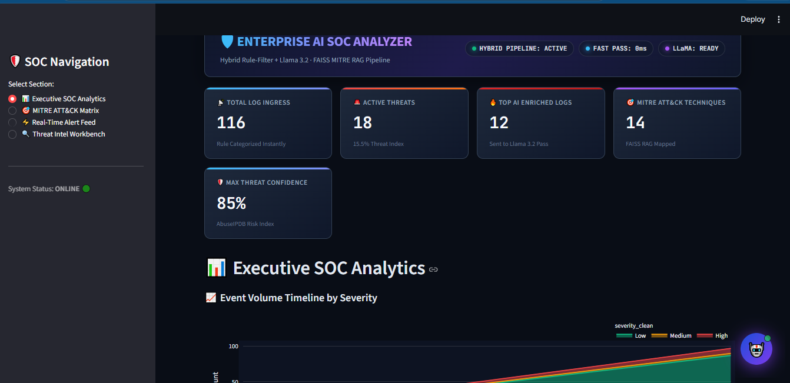

## System Architecture & Flow


## **DASHBOARD**



## 📂 Project Structure

```text
AI_SOC/
├── assets/                          # Screenshots & Architecture Diagrams
│   ├── architecture_banner.png
│   ├── dashboard_preview.png        # Your Dashboard Image
│   └── system_flow.png
│
├── data/                            # Log Input Streams & History CSVs
│   ├── alert_history.csv
│   ├── eve.json
│   └── sample_logs.txt
│
├── faiss_mitre_index/               # Vector Database Index for RAG
│   ├── index.faiss
│   └── index.pkl
│
├── src/                             # Core Backend Logic & AI Modules
│   ├── __init__.py
│   ├── diagnose_retrieval.py
│   ├── rag_mitre.py
│   ├── simulate_soc_traffic.py
│   ├── soc_analyst.py
│   ├── soc_pipeline_v2.py
│   ├── suricata_ai_agent.py
│   └── threat_intel.py
│
├── .gitignore
├── app.py                           # Main Streamlit Dashboard Entrypoint
├── docker-compose.yml
├── Dockerfile
├── README.md
└── requirements.txt
```

Installation & Setup Guide

1. Prerequisites
   Ensure you have the following installed on your system:

Python 3.10+

Ollama (with Llama 3.2 model pulled)

Git

2. Pull Llama 3.2 Model
   Before running the pipeline, make sure Ollama is running locally:

Bash

```Shell
ollama run llama3.2
```

3. Clone Repository & Setup Environment

```Shell
Bash
git clone [https://github.com/your-username/AI_SOC.git](https://github.com/your-username/AI_SOC.git)
cd AI_SOC

# Create virtual environment

python -m venv venv

# Activate Virtual Environment (Windows)

venv\Scripts\activate

# Install requirements

pip install -r requirements.txt
```

4. Run Application (Local or Docker)
   Run via Local Python:

```Shell
python -m streamlit run app.py
```

Run via Docker Compose:

Bash

```Shell
docker-compose up --build -d
```

Environment Variables Setup (Optional CTI Keys) For live IP lookup on AbuseIPDB & VirusTotal, create a .env file in the root folder:

Code snippet

-->ABUSEIPDB_API_KEY="your_abuseipdb_api_key" //thread_intel.py

-->VIRUSTOTAL_API_KEY="your_virustotal_api_key" //thread_intel.py

* Features Hybrid Processing Pipeline: Fast-path rule filtering paired with deep-pass local LLM triage.
* Local RAG Integration: FAISS Vector Index mapping events to 700+ MITRE ATT&CK techniques.
* Interactive UI: Streamlit dashboards featuring Plotly analytics, live alert feeds, and CTI workbenches.
